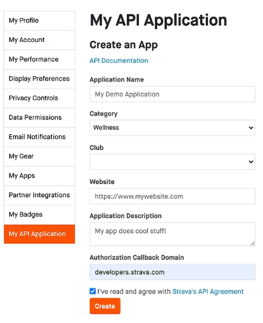
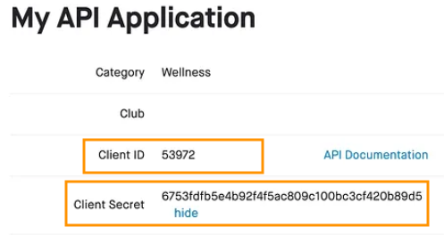
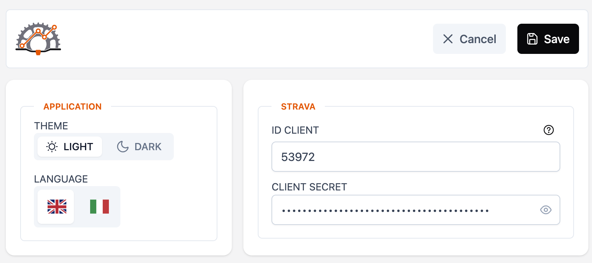

# MTB Wise


<br />
This application manages your MTB data and activities.
<br />
Based on Strava API you can check your suspensions usage and monitoring the bike maintenace.
<br />
For each activity it is possibile to open Map and Photos

<br /><br />

## Setup

Download the latest version from the [Releases](https://github.com/civa86/mtb-wise/releases)

#### MAC OSX (First Time Run)

Open a Terminal and run the following command:

```bash
xattr -c /Applications/MTBWise.app
```

## Strava Application

A Strava Application is needed to connect to Strava API and make MTBWise working.

Getting Started: [https://developers.strava.com/docs/getting-started/](https://developers.strava.com/docs/getting-started/)

Create the application and insert `Client ID` and `Client Secret` inside `MTBWise Settings`.

  

## Development

```bash
# Install dependenciens
yarn install
# Run development server
yarn dev
# Build for MAC OSX to test the build locally
yarn build:mac
```

#### Strava API Reference

[https://developers.strava.com/docs/reference/](https://developers.strava.com/docs/reference/)

#### User Data

Location where user Data and Settings will be stored

```bash
# Mac OSX
open ~/Library/Application\ Support/mtb-wise
```

#### Application Icon

Design icon with 1024x1024 resolution and save it: `resources/icon.png`

Requirements:

- [ImageMagik](https://imagemagick.org/)

```bash
# Run icons generator script
./icon-make.sh
```
